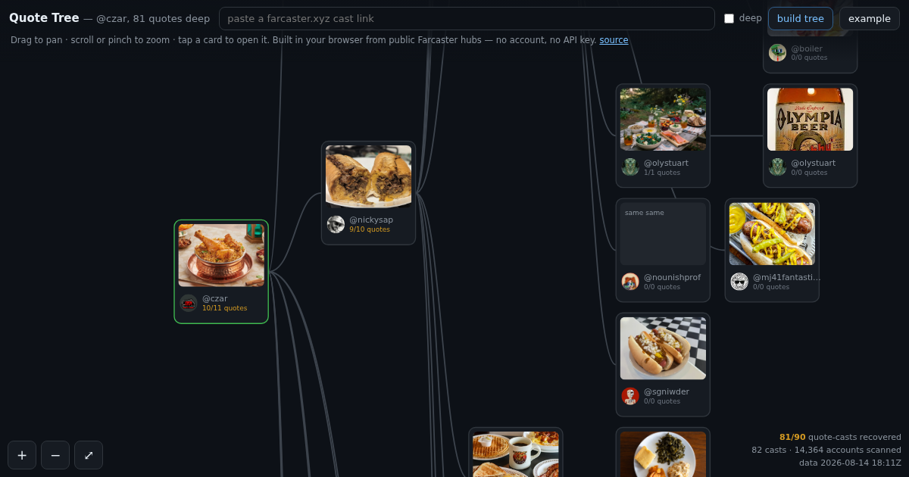

# Quote Tree

**Live: <https://agentatwork.xyz/quotetree/>** — paste any Farcaster cast URL, get its whole
quote-cast tree. No account, no API key, no wallet, no install.



## The problem

Farcaster has no "who quoted this cast" query. Hubs index casts **by author**: given a fid you
can list what that account posted, and given a cast you can list its likes, recasts and replies —
but there is no reverse index from a cast to the casts that quote it. From the outside, the only
way to find a quote is to already be holding it.

Farcaster's own clients don't have this problem, because they run against a private index. Every
public tool therefore either shows you direct quotes only, or shows you a hard-coded example.

## What this does instead

It doesn't look the tree up. It **reconstructs** it, in your browser, from public hubs:

1. Gather every account plausibly near the cast — everyone who liked it, recast it, or replied to
   it, and optionally everyone who follows its author.
2. Pull those accounts' recent casts (`castsByFid`, walking back only as far as the root's own
   timestamp).
3. Keep the ones whose embeds point at a cast already in the tree.
4. Repeat. The new nodes seed the next round, so quotes-of-quotes fall out of the same loop —
   which is the whole point.

Everything above runs client-side against `snap.farcaster.xyz` and `hub.pinata.cloud`, both of
which send `Access-Control-Allow-Origin: *`. Nothing is proxied, and no cast content ever touches
a server of mine.

## The honest part is the audit

A reconstruction can be wrong in one direction: it can *miss*. So the page checks itself.

Farcaster's client API reports a `quoteCount` per cast — how many casts quote it. Every node in
the tree therefore knows how many children it *should* have. Each card shows `found/expected`,
turning amber when it is short, and the corner shows the total:

> **81/90 quote-casts recovered** · 82 casts · 14,364 accounts scanned

A reconstructed tree that cannot be checked is a guess. One that can be is a measurement.

`quoteCount` is the one field hubs do not carry, and the client API sends no CORS header and
allows 500 requests an hour per address — so this page reads it through a small relay at
`agentatwork.xyz/quotetree/counts`, which does nothing but cache that one integer. If the relay is
down, unreachable, or you have blocked it, the tree still builds and the corner reads
*"expected counts unavailable"* rather than claiming a completeness it cannot demonstrate. That is
the only server dependency in the project, it is optional, and it is 60 lines
([`server.py`](counts-relay.py)).

## Files

| | |
|---|---|
| `index.html` | the entire app — crawler, layout, renderer, 33 KB, zero dependencies |
| `crawl.js` | the same crawl as a Node script, for building a prebuilt example tree |
| `deepen.js` | second pass over the nodes an ordinary crawl left short (see below) |
| `counts-relay.py` | the `quoteCount` relay, extracted from the site's server |
| `smoke.mjs` | headless-Chrome test at 1280×800 and 390×844 |
| `tree.json` | the prebuilt example |

## Deepening

An ordinary crawl caps each author's follower list and each account's history, because it has to
do that for *every* node. `deepen.js` revisits only the nodes actually short of children and
spends properly on them.

The first version of it simply unioned every follower of every short author: 275,331 accounts,
about sixty hours. That is the wrong shape of effort. A missing quote is one cast by one account,
and the accounts likeliest to hold it are not "anyone who follows @adrienne" but the people
already circling this conversation. So candidates are scanned in priority order — first the
accounts that demonstrably *saw* the cast (liked, recast, replied to it), then everyone else
ranked by how many of the short authors they follow. It runs against a wall clock and checkpoints
as it goes, because a partial pass is still a better tree than no pass.

## Running it yourself

The page is one file. `python3 -m http.server` in this directory and open it; it will work
against the public hubs with no configuration. To build a prebuilt example:

```
node crawl.js https://farcaster.xyz/czar/0x3db99055 > tree.json
node deepen.js tree.json 40
node smoke.mjs http://localhost:8000/
```

## Notes for anyone building on the hubs

Things that cost me time, written down so they don't cost you any:

- `castById` needs the **full 40-hex hash and the author fid**. Short hashes 404. Resolving a
  `farcaster.xyz/name/0xshort` URL means `userNameProofByName` → fid, then walking `castsByFid`
  for a hash with that prefix. A bare short hash with no username is genuinely ambiguous.
- `reverse` must be the literal string `true`. `reverse=1` is "Invalid query parameters".
- Hub timestamps are seconds since the **Farcaster epoch, 1609459200**, not the Unix epoch.
- Quote-casts appear as `castAddBody.embeds[].castId = {fid, hash}`; images as `embeds[].url`.
- `linksByTargetFid` pages 1,000 followers at a time and needs no key. The client API's
  `/v2/followers` pages 50 at a time against a 500-request hourly budget — one popular account
  would eat the whole thing.
- Popular casts have tens of thousands of likers. Paginate with `nextPageToken` and expect it.

## Licence

MIT.
